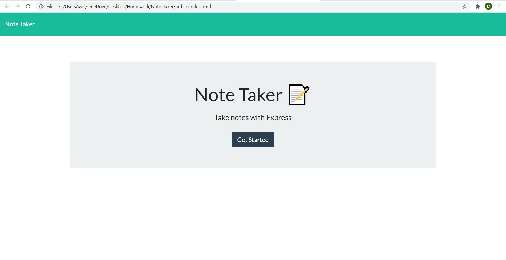

# Note-Taker

https://www.github.com/Jwilliams25400


### [] 


## Description
### This is a quick and efficient method of helping business owners write and save notes too keep track of task that don't require immediate attention but need to be addressed when time permits. 
--------------------

## Technology
### HTML, CSS, Javascript
--------------------

## HEROKU
https://note-taker-jw21.herokuapp.com/

## Table of Contents:


* [Installation](#installation)

* [Usage](#usage)

* [Contributing](#Contribute)

* [Test](#test)

* [Questions](#questions)

# License
    project is Licensed under MIT
--------------------


## Installations:
to ensure the repo runs open the terminal and run the following: 
```npm i express, npm i uuid, and heroku```



--------------------

## Usage:
### none 
--------------------

## Test:
### In order to run the repo, open the terminal and run the following: npm start
--------------------

## Contribute:
### feel free to email repo owner with tips and ideas to enhance the repo efficiency and/ or user experience.
--------------------


## This project is licensed under: 
###  [License](#license)
--------------------


## Questions: 
### if you have any question about the repo, contact Github: (https://www.github.com/Jwilliams25400)
or E-mail: Jwilliams25400@yahoo.com